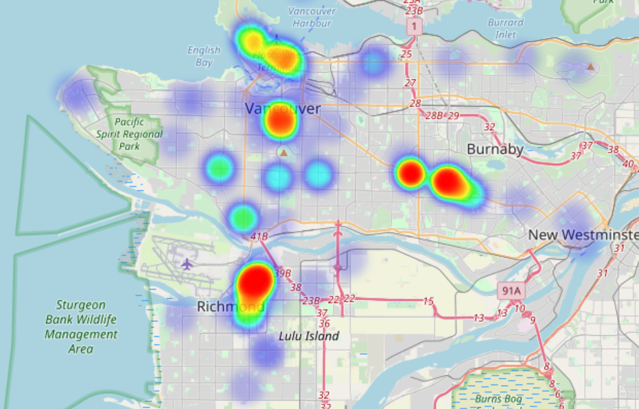

# Boba Map
This console application will tell you where the boba/bubble tea shops are concentrated at a certain location (ie: Vancouver, Burnaby, Seattle, etc.).   
The application uses the `Yelp Fusion REST API` to retrieve the locations, in addition to `Pandas` and `Folium` to create the heatmap from the data.
  
After entering your location and preferences into the console, the program will output the following into your directory:
+ A **heatmap** showing the concentration of boba shops across the area (heatmap.html)
  * The heatmap can also be customized to show higher-rated shops with more weight on the map so that you know where to get the best boba!
+ A **CSV file** that shows the shops and corresponding locations that are used by the map (featured_location_results.csv).
  
  

  

## Extra notes:
+ The map is limited by the number of results available by the Yelp Fusion API.
+ At this time, the console and CSV file cannot display characters that must be decoded from Unicode (ie: Chinese characters). 
