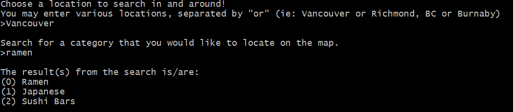

# Business Concentration Map
This console application will tell you where businesses of various categories are concentrated at different locations (ie: Vancouver, Burnaby, Seattle, etc.).   
The application uses the `Yelp Fusion REST API` to retrieve the locations, in addition to `Pandas` and `Folium` to create the heatmap and location markers from the data.  
When the user is searching for a business category to use, the program uses the Yelp Autocomplete function to return relevant supported categories to the user.
  
After entering your location and preferences into the console, the program will output the following into your directory:
+ An **web-based interactive map** showing the following three map formats, which can be toggled by a menu:  
  * A heatmap that shows the concentration of businesses across the area that match the given category.
  * Another heatmap similar to what is described above, but where higher-rated shops appear with more weight on the map.
  * A set of location markers placed where the matching businesses are situated, with business names available on hover.
+ A **CSV file** that shows the shops and corresponding locations that are used by the map.
  
  
  
  

  

## Extra notes:
+ The searchable categories are denoted on the [Yelp Developers website](https://www.yelp.com/developers/documentation/v3/all_category_list).
+ The map only includes businessses with at least one Yelp review.
+ At this time, the console and CSV file cannot display characters that must be decoded from Unicode (ie: Chinese characters). 
